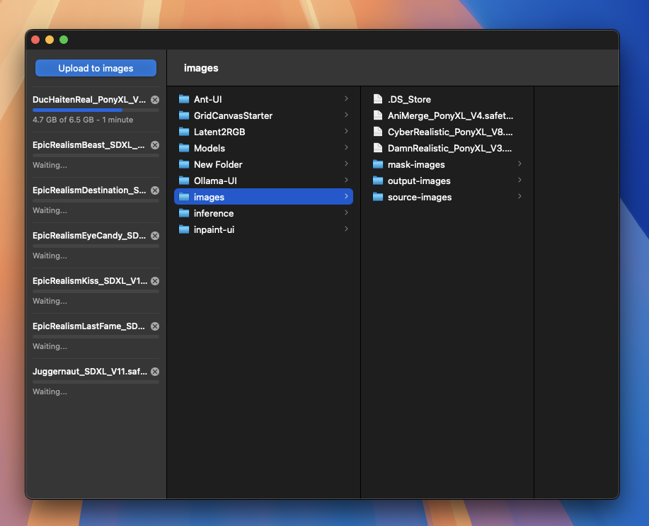

# Cloud Volume Manager

A web-based file manager for EFS/NFS cloud volumes with an interface similar to MacOS Finder Columns.

## Overview

This application provides an intuitive column-based file browser that allows you to navigate, manage, and organize files on your cloud storage volumes. Built with a clean, responsive interface that mimics the macOS Finder experience while offering cloud storage capabilities.

## Features

- **Column-based Navigation** - Navigate through directories using the familiar macOS Finder column view
- **Drag & Drop Support** - Move files and folders with intuitive drag and drop operations
- **File Upload** - Upload files directly to your cloud volume with progress tracking
- **Context Menus** - Right-click context menus for file operations
- **Keyboard Shortcuts** - Standard shortcuts for selection, deletion, and navigation
- **Multi-selection** - Select multiple files and folders for batch operations
- **Real-time Updates** - Live updates as you navigate and modify your file structure
- **Responsive Design** - Works seamlessly across desktop and mobile devices

## Features Coming Soon

- **Global Search** - Search through files and folders
- **Input Base Directory** - Input at the bottom of the sidebar for overriding the environment base directory variable.
- **File Info Preview Column** - Show file metadata and preview media in a column to the right of the selected file.

## Technology Stack

- **Frontend**: Vanilla HTML, CSS, and JavaScript
- **Backend**: Node.js with Express
- **File Upload**: TUS protocol for resumable uploads
- **Storage**: EFS/NFS cloud volumes

## File Operations

- Create new folders
- Rename files and folders
- Delete items
- Move files between directories
- Upload files with progress tracking
- Navigate through nested directory structures

## Interface

The interface features a clean, modern design with:
- Sidebar for upload controls and queue management
- Multi-column file browser for easy navigation
- Path breadcrumbs showing current location
- File type icons and folder indicators
- Drag and drop visual feedback

Perfect for managing cloud storage with the familiar feel of a desktop file manager.